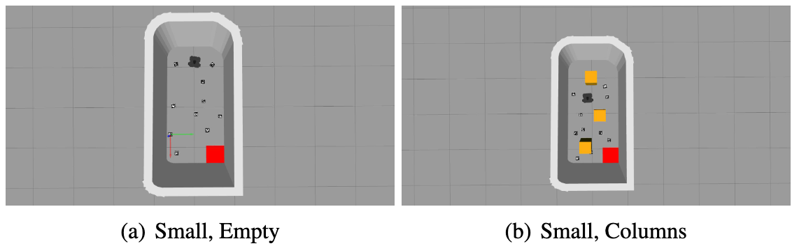
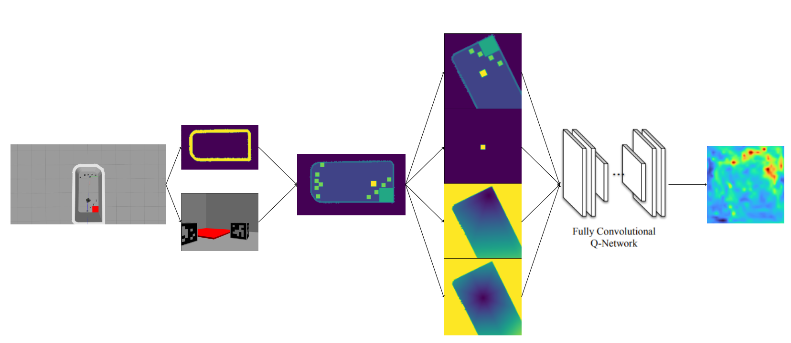
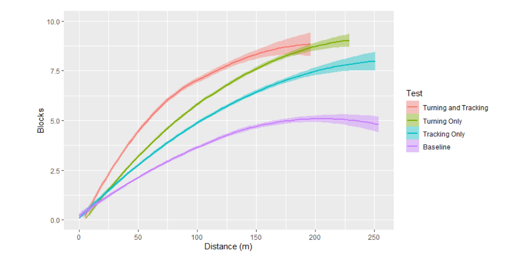
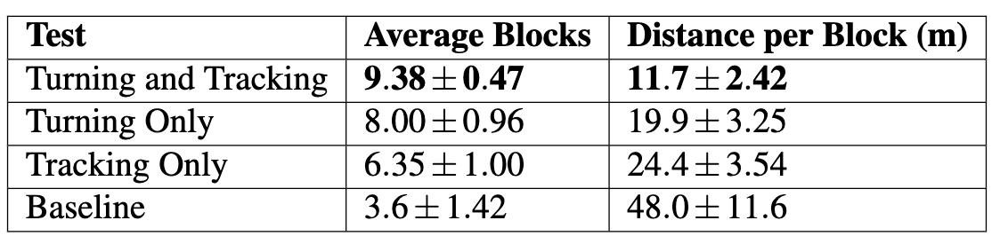
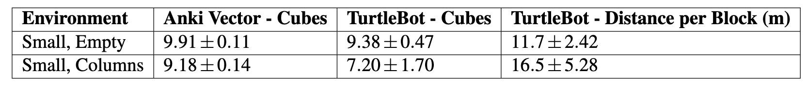

# Turtlebot3 Action Map

## Overview

### Introduction

This project aims to convert spatial action map policies designed for Anki-Vector robots to Turtlebots[^2]. In doing so, we seek to demonstrate the transferability of such policies to new agents and identify key areas of friction.

### Motivation

This project is primarily motivated by the desire to create transferable robot policies that require little consideration to use on new agents. In general, as policies are abstracted from low-level control systems, they become more transferable. This is due to the fact that different agenets will have different control systems. Spatial action maps take a variety of overhead maps and output coordinates for the agent to travel to. In doing so, the agent is given the ability to determine what controls to use to arrive at the specified coordinates. Thus, spatial action maps seem to provide an ideal framework for training transferable policies.

## Setup

### Task

The task the policy seeks to complete is sweeping blocks into a receptacle. This could be viewed as a trash pickup task or something equivalent.

### Environment

For testing, we used two environments replicated from the original spatial action map paper. The first is a small, empty environment with blocks randomly placed around the environment (a). The second is a similar setup, but it has 1 to 3 columns randomly placed around the environment (b).


### Spatial Action Maps

Below is an example of the how the spatial action map policy works.

The first image is an example of the simulated environment followed by what the agent sees and the SLAM overhead map. These are combined to place the location of the blocks in the constructed overhead map. This overhead map is then used to calculate the local map, a mask of the robot's location, the distance to the receptacle, and the distance from the agent all in the agent's coordinates. These are then fed into a fully convolutional Q-network which outputs an overhead map where each pixel's value represents the predicted value of the agent navigating to the corresponding coordinate.

### Implementation

We identified a few key movement patterns and assumptions in the Anki-Vector robot, so we interpolated between a raw policy transfer with no movement pattern mimicking and a full mimicking of the Anki-Vector robot's movement patterns. First, the the Anki-Vector robots always turned in the direction of movement and went in straight lines. Second they had perfect tracking of blocks once they had been seen. This resulted in four experiment implementations:

- Baseline
- Turning
- Perfect Tracking
- Turning and Tracking

## Results

We found that as we added movement patterns and assumptions from the original training setup on Anki-Vector robots, the efficiency increased as well. This is especially true for the movement patterns. This can be seen in the graph below.


A breakdown of each test can be seen in the table below.


We wanted to compare the results obtained from the TurtleBot3 simulations to the original results found on Anki-Vector robots. A comparison for the two environments can be seen in the table below.


## Conclusion

The policies seem to transfer fairly well. However, the efficacy of the transfer appears to be highly dependent on mimicking the movement patterns and assumptions of the original agent that the policies were trained on.

<!-- ## Installation

### Dependencies

Tesseract-ocr and libtesseract-dev are required some of the functionalities to work properly. You can download these in the following ways.

##### macOS

```bash
brew install tesseract
brew install --HEAD tesseract
```

##### Ubuntu

```bash
sudo apt-get install tesseract-ocr
sudo apt-get install libtesseract-dev
```

##### Windows

I suggest viewing https://tesseract-ocr.github.io/tessdoc/Downloads.html

##### Deactivate Tesseract

Alternatively, you can deactivate ocr functionality using:

```bash
python detect.py --source destination/to/video/folder --weights weights/best.pt --tes_enabled=True
```

### Download

To download the repository, run the following commands in the directory of your choice:

```bash
git clone https://github.com/Dreamweaver2k/LP-Privacy.git
```

You can now download the python dependencies by running:

```bash
cd ./LP_privacy
pip install -r requirements.txt
```

## Usage

### Running Locally

To run the detection and obfuscation model on a video, navigate to the LP_privacy directory, ensure all the requirements are installed, and run:

```bash
python detect.py --source destination/to/video/folder --weights weights/best.pt
```

This will run the detection model at .2 confidence threshold. If you want to change this threshold, run it with the conf-thresh parameter.

```bash
python detect.py --source destination/to/video/folder --weights weights/best.pt --conf-thres .5
```

Note that the source flag must point to a folder containing your video file. You can run it on our provided video file using:

```bash
python detect.py --source video/original_lp_footage.mp4 --weights weights/best.pt
```

### Running on Google Colab

The license plate privacy detection and blurring system can be tested for personal use on Google Colab. First, ensure that the proper packages are installed in the Colab runtime:

```python
!pip install opencv-contrib-python==4.4.0.44
!apt install tesseract-ocr
!apt install libtesseract-dev
!pip install pytesseract
!git clone https://github.com/Dreamweaver2k/LP_privacy.git
```

Once these have finished loading, you will have all the necessary files to detect and blur license plates in your personal videos as well as the the dependent packages. Now, you can run detect.py to perform the privacy function on your specified video:

```python
!python LP_privacy/LP_privacy/detect.py --source destination/to/video/folder --weights LP_privacy/LP_privacy/weights/best.pt
```

### Training New Weights

To train new weights, you will need to download YOLOv5 [^2]. Once this is done, you can utilize the Chinese City Parking Dataset [^1] (CCPD) which I have annotated for use in a YOLO model. See reference for original dataset.
To download YOLOv5, run the following in Google Colab:

```python
!git clone https://github.com/ultralytics/yolov5
```

To train new weights in Google Colab, run the following:

```python
%load_ext tensorboard
%tensorboard --logdir runs/

!python yolov5/train.py --img 416 --batch 4 --epochs 20 --data LP_privacy/LP_privacy/training_data/data.yaml --cfg yolov5/models/yolov5l.yaml --name lpmodel
```

Note, for the cfg flag, the users can select whatever YOLO model size they want. Smaller architectures train and deploy faster. Larger architectures may provide better performance. -->

<!-- ## License

[](https://opensource.org/licenses/MIT) -->

[^2]: [Online]. Available: https://github.com/jimmyyhwu/spatial-intention-maps
